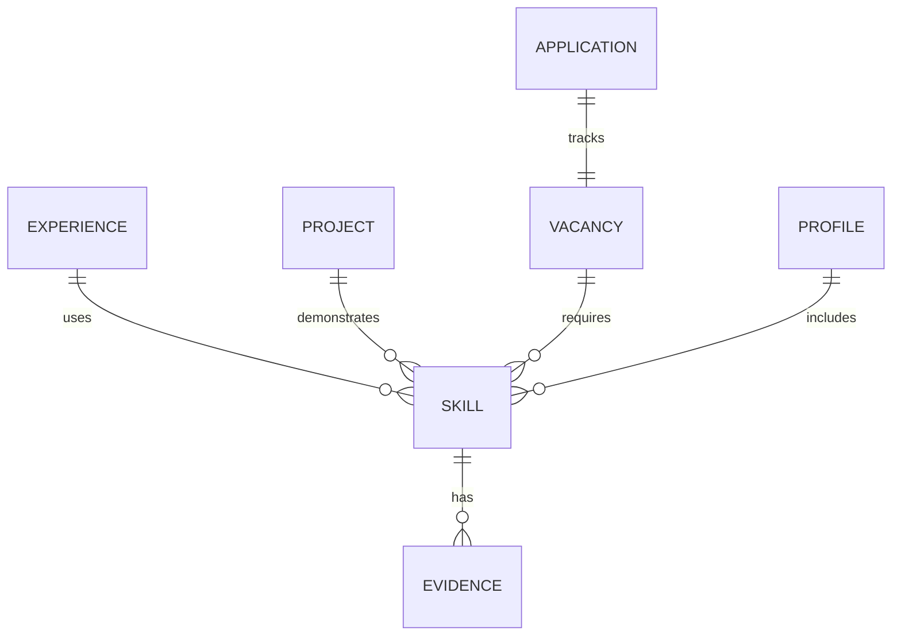

# CareerGraph Codebase Analysis

**Status:** Reverse engineering from existing workspace
**Date:** 2026-08-19
**Warning:** Documenting ONLY what is actually present. Unknown/Not implemented marked as TODO/Unknown

## 1. Project Structure Overview

### What actually exists

```
CareerHub/
├── Docs/                          # Documentation only
│   ├── CareerGraph_Product_Documentation.md
│   ├── archive/
│   ├── planning/
│   │   ├── drafts/
│   │   │   ├── adrs/
│   │   │   └── roadmaps/
│   │   └── exports/
│   └── planning/
├── .cursor/                       # Cursor IDE config
│   ├── mcp.json
│   ├── doc-index/
│   └── rules/
├── .dochub/
│   └── workspace.sqlite          # SQLite DB
├── .gitignore                     # Empty
└── .git/
```

### Technology Stack - Observed

**Frontend framework:** TODO / Unknown
- No source code present in workspace
- Documentation mentions Tauri + React + TypeScript planned

**Backend framework:** TODO / Unknown
- No source code present in workspace  
- Documentation mentions Tauri + Rust planned

**Language:** TODO / Unknown
- No code files found

**Build tools:** TODO / Unknown
- No package.json, Cargo.toml, or build config found

**Package manager:** TODO / Unknown
- No package manager files found

**Main dependencies:** TODO / Unknown
- No dependency files found

**Database:** SQLite (`.dochub/workspace.sqlite` exists)
- doc-memory workspace DB present
- Not CareerGraph DB - this is Doc-Hub infrastructure

### Responsibility Map

**Docs/** - Product documentation and planning
- Current state: Product concepts only, no technical implementation
- Contains CareerGraph_Product_Documentation.md with architecture plans

**.cursor/** - IDE configuration
- MCP server config for doc-memory
- Doc-index artifacts for Doc Hub

**.dochub/** - Doc Hub infrastructure
- SQLite workspace database
- Not CareerGraph code

**Codebase:** NONE FOUND
- No frontend code
- No backend code  
- No tests
- No configuration files
- Only documentation exists

---

## 2. Frontend Architecture

**Status:** NOT IMPLEMENTED

### Analysis Result
No frontend code exists in workspace.

**Observed:**
- Docs mention planned stack: Tauri + React + TypeScript
- Code style documented: Prettier semi:true tabWidth:2, SCSS modules + BEM
- Component structure planned: one folder = one component with index.ts

**Reason:** Unknown - documentation exists but code does not
- May be planned but not started
- May exist in different location
- May be documentation-first approach

**Entry points:** TODO / Unknown
**Routing:** TODO / Unknown  
**State management:** TODO / Unknown
**Data fetching:** TODO / Unknown
**API layer:** TODO / Unknown
**Components structure:** TODO / Unknown

---

## 3. Backend Architecture

**Status:** NOT IMPLEMENTED

### Analysis Result
No backend code exists in workspace.

**Observed:**
- Docs mention planned stack: Tauri Rust backend
- Commands structure from Doc-Hub canon documented
- SQLite SoT pattern documented

**Reason:** Unknown

**Framework:** TODO / Unknown
**Entry point:** TODO / Unknown
**Modules:** TODO / Unknown
**Controllers:** TODO / Unknown
**Services:** TODO / Unknown
**Repositories:** TODO / Unknown

---

## 4. Domain Model

**Status:** DOCUMENTED ONLY - No code implementation

Based on product documentation, planned entities:

### Planned Entities from Docs

**Professional Memory:**
- Skills
  - name
  - type: commercial / personal project / hobby / learning
  - level / confidence
  - evidence references
  - last used date
- Experience
- Projects  
- Evidence
- Achievements
- Technologies
- Career goals
- Limitations

**Vacancy Intelligence:**
- Vacancy
  - title
  - company
  - description
  - required skills
  - seniority
  - salary
  - location
  - source
  - date

**Matching Engine:**
- Match score 0-100%
- Strong matches
- Missing skills
- Risk factors

**Positioning Profiles:**
- Multiple profiles per candidate
- Skill/experience grouping per profile

**Application Tracking:**
- Vacancy reference
- Application date
- CV version
- Status
- Response

**Market Intelligence:**
- Market trends
- Competition analysis

**Code Reality:** NONE OF THESE EXIST IN CODE
- No TypeScript interfaces
- No Rust structs
- No database schema
- Only documentation

---

## 5. Database

**Status:** NO CAREERGRAPH DATABASE FOUND

### Existing DB
`.dochub/workspace.sqlite` - Doc Hub infrastructure DB
- Not CareerGraph data
- Used by doc-memory MCP server

### Planned DB
Documentation mentions SQLite with WAL mode:
- `PRAGMA foreign_keys = ON`
- `PRAGMA journal_mode = WAL`  
- `PRAGMA busy_timeout = 30000`

**Actual schema:** TODO / Unknown
**Migrations:** TODO / Unknown
**Tables:** TODO / Unknown

ER Diagram:



**Reality:** All TODO

---

## 6. API Documentation

**Status:** NO APIs EXIST

No endpoints found. No code found.

Planned per docs:
- Profile CRUD
- Vacancy import
- Matching engine
- Application tracking

All TODO / Unknown

---

## 7. Code Style Guide

**Status:** DOCUMENTED BUT NOT ENFORCED

### Frontend Style (from docs)

**Prettier:**
```js
semi: true, tabWidth: 2, useTabs: false, singleQuote: false
trailingComma: "es5", printWidth: 120
```

**Component structure:**
```
components/Profile/Skills/
  Skills.tsx
  Skills.module.scss
  index.ts
```

**SCSS modules:**
- File: `ComponentName.module.scss`
- Root: PascalCase `.Skills`
- BEM: `.Skills__item`
- Modifiers: `&.active`

**classnames/bind:**
```tsx
import classNames from "classnames/bind";
import scss from "./Skills.module.scss";
const cn = classNames.bind(scss);
```

**TypeScript/React:**
- Functional components, named export
- Props type next to component
- View UI state: view-scoped Zustand factory + Provider
- Domain data: React hooks

**Imports order:**
1. React / external
2. Internal absolute
3. Relative
4. SCSS module

**Naming:**
- Component/folder: PascalCase
- Hook: useSomething.ts
- SCSS partial: _name.scss

**Backend Style:** NOT DOCUMENTED IN CODE
No Rust code exists to analyze.

---

## 8. Existing Design Decisions

### Observed Decisions

**Decision:** Documentation-first approach
```
Observed: Extensive product docs exist, no code exists
Reason: Unknown - possibly planned but not started, or code elsewhere
```

**Decision:** Local-first architecture planned
```
Observed: Docs specify Tauri + SQLite local-first
Reason: Documented as requirement
```

**Decision:** Python domain SoT planned
```
Observed: Docs mention `career-memory-mcp` Python worker
Reason: Follows Doc-Hub canon
```

**Decision:** View-scoped Zustand pattern referenced
```
Observed: ADR 0007 pattern mentioned in docs
Reason: Design decision from Doc-Hub
```

**Compromises visible:**
- None - no implementation to analyze

---

## 9. Technical Debt

**Status:** Cannot assess - no code exists

### Critical
- No codebase exists to have debt

### Medium
- Documentation exists without implementation
- Gap between planned architecture and reality

### Low
- Empty .gitignore
- No .cursor/ rules for code standards

---

## 10. Development Workflow

### Current Workflow

**Local run:** TODO / Unknown
- No scripts found
- No README
- No setup instructions

**Env variables:** TODO / Unknown
- No .env files
- No config

**Scripts:** TODO / Unknown
- No package.json
- No Cargo.toml
- No Makefile

**Tests:** TODO / Unknown
- No test files

**Build:** TODO / Unknown
- No build config

**Deployment:** TODO / Unknown
- No CI/CD

---

## 11. Architecture Summary

### For New Senior Engineer - First 30 Minutes

**System Purpose:**
CareerGraph is planned as a local-first career management system for structured professional memory and vacancy matching. Currently only documentation exists - no code.

**Main Modules:**
- NONE IMPLEMENTED
- Planned: Profile Manager, Vacancy Importer, Matching Engine, CV Profiles, Application Tracker, Analytics

**Data Flow:**
```
User → [Not Implemented] → SQLite → [Not Implemented] → UI
```

**Important Rules:**
- Local-first only (planned)
- Truth over beauty (planned)
- Structured data over documents (planned)
- Evidence-based skills (planned)

**Dangerous Areas:**
- No code exists - entire system is documentation
- Gap between docs and reality
- May need to start from scratch

**Next Steps:**
1. Verify if code exists elsewhere
2. Start implementation from product docs
3. Set up Tauri + React + TypeScript
4. Implement SQLite schema per domain model
5. Build MVP per documented modules

---

## Conclusion

**Reality Check:** This workspace contains ONLY documentation. No CareerGraph code exists.

The workspace has:
- Product documentation
- Planned architecture
- Doc-Hub infrastructure
- No source code

This is either:
1. Documentation-first project not yet started
2. Code exists in different location
3. Project planning phase

**Recommendation:** Do not proceed with code review - no code to review.
